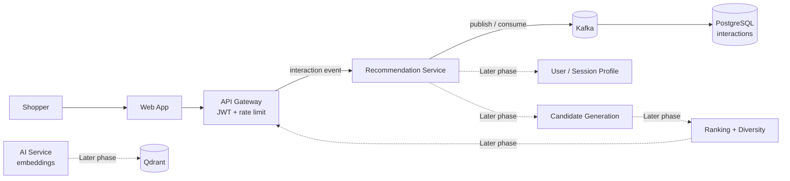

<div align="center">


# Recommendation Service

### Turn scattered shopping signals into context-aware product recommendations.

Recommendation Service is the Bin E-Commerce bounded context for collecting behavioral signals, building preference profiles, and serving relevant products for each shopping session.

<p>
  
  
  
  
  
</p>

</div>

---

> **Current status:** Phase 3 foundations are implemented behind feature flags. Catalog semantic snapshots, durable embedding dispatch, AI worker contracts, Qdrant retrieval, and isolated co-behavior projection run alongside the Phase 2 rule ranker.

## The Problem

A newest-products or best-selling list can answer “what is available,” but not “what is this shopper likely to care about next.” When product views, searches, and cart actions remain isolated inside different services, recommendations become difficult to personalize, explain, and measure.

Recommendation Service brings these signals together through a stable event contract, stores only data it owns, and evolves from transparent rules to candidate generation, ranking, and machine learning. It follows established recommendation-system patterns while keeping source data, computation pipelines, and serving APIs separate from Product Service.

## See It Work

The service exposes a health check and the Phase 1 interaction ingestion boundary:

```powershell
cd services/recommendation-service
Copy-Item .env.example .env
npm run dev
```

```powershell
curl http://localhost:3006/api/v1/health
```

Minimal response:

```json
{
  "status": "ok",
  "service": "recommendation-service",
  "checks": {
    "http": { "status": "ok" },
    "postgres": { "status": "up" }
  }
}
```

Swagger is enabled only in development at `http://localhost:3006/docs`.

## Quick Start

### Prerequisites

- Node.js 20 or later.
- PostgreSQL with a database named `bin_ecommerce_recommendation`.
- Root infrastructure running when using the shared local environment.
- Kafka is required for durable event ingestion and asynchronous persistence.

### Run locally

```powershell
cd services/recommendation-service
Copy-Item .env.example .env
npm install
npm run dev
```

The service listens on `http://localhost:3006` with the `/api` prefix. Schema changes will use versioned migrations; `synchronize` is disabled.

> **Trust boundary:** The service writes only to the PostgreSQL database owned by Recommendation Service. Browsers should not call it directly in production; API Gateway will own JWT validation, route policy, rate limiting, and trusted identity forwarding. Never commit `.env`, place secrets in event payloads, or query Product, Order, or Seller Service databases directly.

## What the Service Owns

| Responsibility       | Recommendation Service owns                                                            |
| -------------------- | -------------------------------------------------------------------------------------- |
| Behavioral signals   | Normalize, validate, and store interactions used by recommendation pipelines           |
| Preference profiles  | Calculate user/session weights in later phases                                         |
| Candidate generation | Produce candidates from behavior, categories, similar products, and business rules     |
| Ranking              | Order candidates by context, freshness, quality, and diversity                         |
| Recommendation API   | Return products with source, reason, and metadata for the frontend                     |
| Measurement          | Attach impression, click, and conversion signals to calculate CTR and purchase metrics |

The service does not own product master data, prices, inventory, order state, seller profiles, or payment data. When those facts are needed, it will use the explicit API or event contract of the owning service.

## Target Flow



The core rule is simple: events enter through an authenticated boundary and are durably stored before being used for computation. Recommendation responses never read another service's database directly.

## Phase 1 — Event Foundation

Phase 1 is the data foundation, not the ranking engine. Its goal is to create a reliable path from shopper behavior to a durable interaction store so later phases have clean, replayable data.

### Scope

1. The shared `recommendation.interaction.recorded` contract lives in `packages/common`.
2. Gateway exposes `POST /api/v1/recommendation/events` for authenticated and guest sessions.
3. Recommendation Service validates the interaction allow-list and bounded context fields.
4. Kafka topic `recommendation.interactions.v1` is keyed by `userId` or `sessionId`.
5. The consumer deduplicates by `eventId` and persists to `recommendation_interactions`.
6. Invalid events and exhausted persistence retries are published to `recommendation.interactions.dlq.v1`.
7. Web emits view, click, impression, search, add-to-cart, and remove-from-cart signals without blocking UX.
8. Migrations and unit tests cover anonymous, malformed, duplicate, and retry paths.

### Phase 1 Interaction Types

| Type                        | Trigger                                                   | Pipeline value                  |
| --------------------------- | --------------------------------------------------------- | ------------------------------- |
| `PRODUCT_VIEWED`            | Shopper opens a product detail or views an item           | Lightweight interest signal     |
| `PRODUCT_CLICKED`           | Shopper clicks a product from a listing or recommendation | Intentional interest signal     |
| `PRODUCT_IMPRESSED`         | A product is actually shown in the viewport               | Denominator for CTR measurement |
| `SEARCH_PERFORMED`          | Shopper completes a search                                | Current shopping intent         |
| `PRODUCT_ADDED_TO_CART`     | Shopper adds a variant to the cart                        | Strong purchase intent          |
| `PRODUCT_REMOVED_FROM_CART` | Shopper removes an item from the cart                     | Reduced interest signal         |

### Explicitly Out of Scope for Phase 1

- Qdrant or vector similarity search.
- OpenAI or AI Service embedding generation.
- User profiles, category affinity, or real-time session intent.
- Ranking models, collaborative filtering, or deep personalization.
- Serving recommendations from this service; the frontend will continue using its existing product source until the recommendation API is approved.

## Event Contract

Events will use the monorepo integration envelope with `eventId`, `eventName`, `eventVersion`, `source`, `occurredAt`, `aggregateId`, `metadata`, and `data`.

Example payload:

```json
{
  "eventId": "8f4d1c89-9dd5-4a4d-a0ec-222222222222",
  "eventName": "recommendation.interaction.recorded",
  "eventVersion": 1,
  "source": "api-gateway",
  "occurredAt": "2026-09-04T10:00:00.000Z",
  "aggregateId": "session-or-user-id",
  "metadata": {
    "correlationId": "request-123"
  },
  "data": {
    "interactionType": "PRODUCT_VIEWED",
    "userId": null,
    "sessionId": "00000000-0000-4000-8000-000000000001",
    "productId": "product-uuid",
    "variantId": null,
    "categoryId": "category-uuid",
    "query": null,
    "page": "home",
    "position": 4,
    "quantity": null,
    "requestId": "request-123"
  }
}
```

`eventId` is the mandatory idempotency key. `userId` comes from Gateway-authenticated identity; `sessionId` is used for guests. Do not put email addresses, access tokens, addresses, payment data, or unnecessary sensitive information in interaction events.

## API Reference

### Available

| Method | Route         | Purpose                                     |
| ------ | ------------- | ------------------------------------------- |
| `GET`  | `/api/v1/health` | Check HTTP and PostgreSQL connection status |

### Phase 1

| Method | Route                           | Purpose                      | Boundary                             |
| ------ | ------------------------------- | ---------------------------- | ------------------------------------ |
| `POST` | `/api/v1/recommendation/events` | Record one valid interaction | API Gateway → Recommendation Service |

Recommendation, feedback, and admin replay routes will be designed after the event foundation has real data and measurable quality signals.

## Data Model

Phase 1 introduces the `recommendation_interactions` table with these data groups:

| Group       | Fields                                                                | Rule                                                   |
| ----------- | ---------------------------------------------------------------------- | ------------------------------------------------------ |
| Identity    | `user_id`, `session_id`                                                | At least one actor; prefer the user when authenticated |
| Interaction | `interaction_type`, `product_id`, `variant_id`, `category_id`, `query` | Must match the type-specific allow-list                |
| Event       | `event_id`, `event_name`, `event_version`, `source`, `occurred_at`     | `event_id` is unique for deduplication                 |
| Context     | `page`, `position`, `request_id`, bounded metadata                     | No secrets or unnecessary PII                          |
| Processing  | `received_at`, `processed_at`, `processing_status`                     | Supports retry, replay, and failure auditing           |

The schema is created by the versioned migration `1788020000000-create-recommendation-interactions`.

## Phase 2 Implementation

Phase 2 turns the interaction ledger into a usable, explainable recommendation read model:

- PostgreSQL stores actor profiles, normalized preferences, catalog snapshots, popularity aggregates, and projection idempotency records.
- Kafka consumers project interaction, catalog, and completed-purchase events without reading another service's database.
- Redis stores short-lived session intent and five-minute recommendation results; PostgreSQL remains the durable source of truth.
- Candidate generation combines product/category/brand affinity, recent context, trending, best-selling, newest, and deterministic exploration sources.
- Rule-based ranking applies profile affinity, session context, popularity, freshness, quality, exploration, diversity constraints, and reason mapping.
- `GET /api/v1/recommendation/recommendations` performs backend pagination (maximum 24 items per page). Guests can read page one; authenticated users can continue paging.
- `POST /api/v1/recommendation/profile/merge` merges an anonymous session profile into the authenticated user's profile idempotently.

### Catalog bootstrap

Set `CATALOG_BOOTSTRAP=true` and configure `INTERNAL_SERVICE_TOKEN` to import the existing public catalog from Product Service on startup. The same operation is available through the protected `POST /api/v1/recommendation/catalog/bootstrap` endpoint. Re-running the bootstrap is safe because catalog records are upserted by product ID.

Phase 2 intentionally does not include embeddings, Qdrant, collaborative filtering, or ML ranking. Those capabilities can consume the stable profile and catalog contracts in later phases.

## Phase 3 — Catalog Intelligence and Candidate Sources

Phase 3 enriches the recommendation-owned catalog without changing the final Phase 2 ranking formula:

- Product Service emits monotonic `catalogRevision` snapshots with bounded semantic content and a deterministic `contentHash`.
- Recommendation stores semantic fields and durable `recommendation_embedding_jobs`; a PostgreSQL lease dispatcher publishes requests only after a job is claimed.
- AI Service runs `embedding-worker` as a separate process and publishes generated vectors using `text-embedding-3-small` by default. Provider failures retry and malformed messages go to the embedding DLQ.
- Recommendation validates product ID, content hash, model and dimensions before upserting a vector into the Qdrant alias `recommendation_product_embeddings_current`.
- Semantic similarity and co-view/co-cart/co-purchase sources contribute candidates with source, raw score and anchor metadata. Their failures are fail-soft and Phase 2 sources remain available.
- Relation projection uses `recommendation-relations-v1`, separate from profile projection, with bounded windows and a projection ledger for idempotency.

Enable candidate sources gradually:

```env
CANDIDATE_PIPELINE_V3_ENABLED=false
SEMANTIC_CANDIDATES_ENABLED=false
CO_BEHAVIOR_CANDIDATES_ENABLED=false
QDRANT_URL=http://localhost:6333
QDRANT_COLLECTION_ALIAS=recommendation_product_embeddings_current
QDRANT_VECTOR_SIZE=1536
EMBEDDING_MODEL=text-embedding-3-small
EMBEDDING_MODEL_VERSION=text-embedding-3-small
```

Phase 3 deliberately does not apply semantic/relation scores to ranking. Phase 4 can consume the preserved contributions after offline overlap, coverage, latency and conversion metrics are available.

## Project Structure

```text
services/recommendation-service/
├── src/
│   ├── database/
│   │   ├── entities/                    # Persistence models owned by this service
│   │   └── migrations/                  # Versioned schema changes
│   ├── modules/
│   │   ├── health/                      # Runtime health boundary
│   │   ├── interactions/                # Event ingestion and persistence
│   │   ├── profiles/                    # Durable preferences and session intent
│   │   ├── catalog/                     # Recommendation-owned product read model
│   │   └── recommendation/              # Candidate, ranking, and serving API
│   │       ├── application/             # Use cases, contracts, processing rules
│   │       ├── infrastructure/          # Repository and Kafka adapters
│   │       └── presentation/            # Controllers and DTO validation
│   ├── kafka/                           # Producer, consumer, and topic wiring
│   ├── app.module.ts                    # Module composition
│   └── main.ts                          # HTTP bootstrap
├── .env.example
├── nest-cli.json
├── package.json
├── tsconfig.build.json
├── tsconfig.json
└── README.md
```

Dependency direction is one-way: presentation calls application; application knows only contracts and ports; infrastructure implements adapters. Database entities must not be imported into controllers.

## Environment

| Variable               | Local default                    | Purpose                                   |
| ---------------------- | -------------------------------- | ----------------------------------------- |
| `PORT`                 | `3006`                           | HTTP port                                 |
| `NODE_ENV`             | `development`                    | Enables Swagger outside production        |
| `POSTGRES_DB`          | `bin_ecommerce_recommendation`   | Database owned by this service            |
| `KAFKA_BROKERS`        | `localhost:29092`                | Broker address when running from the host |
| `KAFKA_CLIENT_ID`      | `recommendation-service`         | Kafka client identity                     |
| `KAFKA_CONSUMER_GROUP` | `recommendation-interactions-v1` | Interaction/profile projection group      |
| `REDIS_HOST`            | `localhost`                      | Session and result cache host             |
| `REDIS_PORT`            | `6379`                           | Session and result cache port             |
| `PRODUCT_SERVICE_URL`   | `http://localhost:3008`          | Bootstrap-only catalog source             |
| `CATALOG_BOOTSTRAP`     | `false`                          | Enable one-time catalog bootstrap         |
| `INTERNAL_SERVICE_TOKEN`| —                               | Secret for catalog bootstrap              |

See the complete sample in [.env.example](./.env.example). Local `.env` files are ignored by Git and must not be used as production secret sources.

## Development Commands

```powershell
npm run dev          # Watch mode
npm run build        # Compile the service
npm run start        # Run the compiled service
npm run type-check   # TypeScript validation without emitting files
npm run lint         # ESLint over src
npm run test         # Jest
```

## Roadmap

<details>
<summary><strong>Detailed future phases</strong></summary>

### Phase 2 — Profiles and Candidate Generation

- Calculate category affinity, product affinity, and session intent.
- Add Redis for short-lived profiles and caches with explicit TTL and invalidation rules.
- Generate candidates from behavior, similar products, categories, and business rules.
- Return source and reason metadata so the frontend and demo can explain recommendations.

### Phase 3 — Catalog Intelligence and Candidate Generation

- Normalize product semantic fields and publish model-versioned embedding jobs.
- Generate vectors through the isolated AI worker and store them behind a rebuildable Qdrant alias.
- Project bounded co-view, co-cart, and completed co-purchase relations in a separate consumer group.
- Union semantic/behavior candidates with Phase 2 sources while preserving attribution and rollback flags.

### Phase 4 — Ranking, Diversity, and Online Adaptation

- Combine relevance, freshness, popularity, availability, and diversity.
- Handle cold-start users, new products, and anonymous sessions.
- Measure CTR, add-to-cart rate, purchase conversion, coverage, and latency.

### Phase 5 — Production Hardening

- Add outbox/DLQ, replay tooling, retention policies, observability, and alerts.
- Load-test event bursts and recommendation read traffic.
- Add A/B testing with guardrails, rollback, and model/rule version auditing.

</details>

## Engineering Rules

- API Gateway is the public entry point; the service must not infer identity from the request body.
- Event contracts are stable cross-service boundaries; never send TypeORM entities through Kafka.
- Every consumer must be idempotent by `eventId`.
- Every schema change must be explicit; `synchronize` is disabled in production.
- Kafka, Redis, Qdrant, and downstream providers must not silently lose accepted data without a retry or DLQ state.
- Recommendations support purchase decisions; they do not replace the owning service's checks for price, inventory, purchase permissions, or order status.

## FAQ

### Why not put recommendations in Product Service?

Product Service owns the catalog and product lifecycle. Recommendation has its own event stream, profiles, ranking, cache, and vector-search concerns; separating them keeps ownership clear and allows independent scaling.

### Why are AI and Qdrant not being added immediately?

Without clean events, embeddings and ranking produce results that are difficult to explain or evaluate. Phase 1 establishes schema, idempotency, and replayability first; semantic search can be added once the contract and metrics are reliable.

### Can guest users receive recommendations?

Yes. The initial implementation will use a UUID v4 `sessionId`. After login, signals can be merged according to an explicit identity policy without trusting client-supplied identity fields.

## Contributing

Keep controllers thin, place business rules inside the relevant interactions or recommendation module, and add tests for every event-contract, idempotency, or ranking-boundary change. Cross-service changes should update the README, contract, and flow diagram together.

## License

This service is part of the Bin E-Commerce monorepo. Follow the license and contribution rules defined at the repository root.
